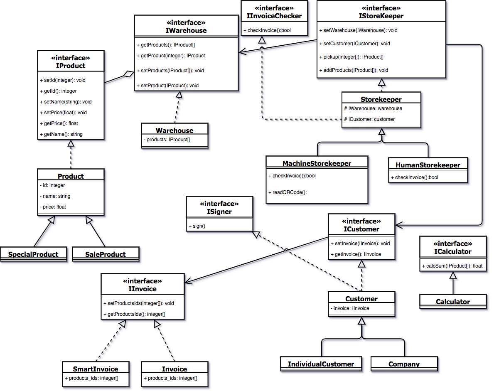

# Демонстрация SOLID принципов

## Управление складом
Данный пример демонстрирует организацию кода с использованием SOLID принципов.
### SOLID принципы
- Принцип единственный обязанности
- Принцип открытости/закрытости
- Принцип подстановки Барборы Лисков
- Принцип инверсии зависимостей
- Принцип внедрения зависимостей
## Диаграмма классов

